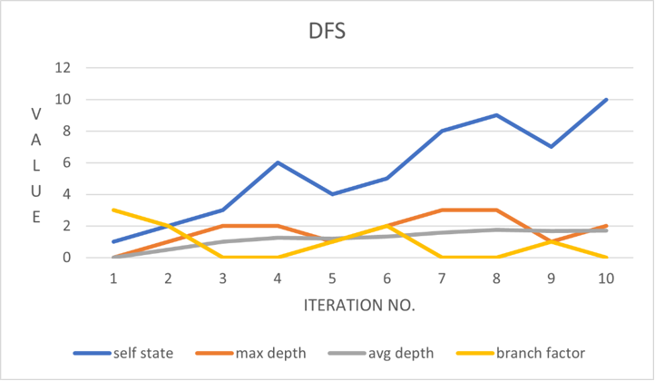
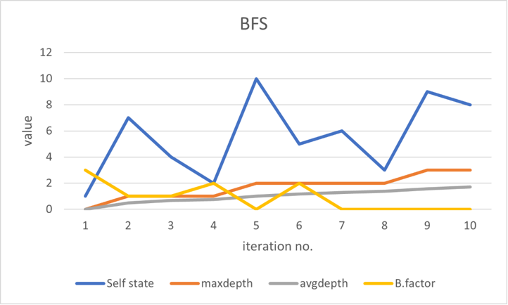
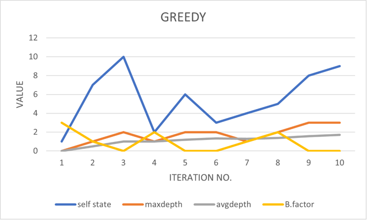

# TREE SEARCH LIBRARY

## Overview

A Generic Tree Search Library is made for exploring a Tree, created with the given input node information, using the corresponding comparator functions written based on their seen time or value, for each of the exploration strategy.The Algorithms that can be implemeneted using this Tree Search Library are DFS, BFS, A-star, Greedy-Search where the next node in each of the strategy is picked from the Priority Queue.In each of the traversal, the information at that particular iteration like average depth, max depth, branching factor are stored in an array and their variation for each of the traversal is analysed and plotted.

## Input-Output Format
 
* we need to enter the exploration strategy in CLI terminal 

* Input format should be as shown:

         <number_of_nodes>:n
         <state_number> <value> <parent_state_number>
         
         ...
         ...
         n times

* The information of the node including the Iteration,State number,max depth,average depth and branching factor for each iteration in the tree traversal is printed.Also Tree that was created is printed with each parent along with corresponding children in the ascending order of their state values.
* Output Format:
     
        <iteration> <state_number> <max_depth> <avg_depth> <Branching_Factor>

        ...
        ...
        n times

- - - - 

## Algorithms Implemented

### DFS:

* In Depth First Traversal(DFS) starting with root node, we explore all the branches as far as possible before backtracking the nodes.

* DFS is widely used algorithm in graphs and has many applications like Detecting a cycle in graph,finding strongly connected components,Topological Sorting,finding the existence of path between two nodes and so on.

 
### BFS:

* In Breadth First Traversal(BFS) starting with root node, we explore all the neighbouring nodes and then go to next depth level and explore all the nodes at that level and continue this till all the nodes at the maximum depth are explored.

* BFS algorithm is also extensively used like in Social Networking Websites,GPS Navigation systems,MST in graphs and so on.

### Greedy Search:

* In Greedy Search algorithm always the nodes with more data value are explored at each level till it reaches the maximum depth and followed by backtracking the nodes with the same strategy.

* Greedy Search Algorithm is useful where we need to select the best option available at that moment without worrying about the future result it would bring like in case of Kruskal's algorithm,Dijkshtra algorithm,single source shortest path problem in graphs, and in many more.

- - - - 

## Graphs
### DFS

### BFS

### GREEDY

- - - - 

### Contributers

* Greeshma  
* Yash
* Nikhil 
* Sanyam
* Astitva 

              THANK YOU !!!
